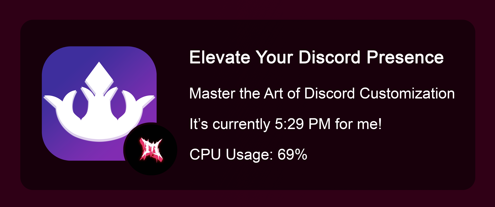

# Rich-Cord

RichCord is a lightweight and highly customizable Electron-based Discord RPC (Rich Presence) tool. It allows you to create and display rich presence information on your Discord profile with ease!

## Table of Contents
- [What is RichCord?](#what-is-richcord)
- [Features](#features)
- [Setup](#setup)
- [Contributing](#contributing)
- [Pull Requests](#pull-requests)

## What is RichCord?

RichCord is a powerful tool that enables you to showcase your activities and status on Discord in a visually appealing way. With RichCord, you can create custom rich presence information and share it with your friends and community.

## Features

- [x] Real-time presence updates
- [x] Starter templates
- [x] GIF support
- [x] Custom image upload
- [x] Custom buttons
- [x] Real-time clock
- [x] Changeable title
- [ ] Support for application-based presences
- [ ] Profile sharing
- [ ] Themes
- [ ] Cycling statuses
- [ ] Account syncing
- [ ] Account info display
- [ ] PC info display
- [ ] System resource usage
- [ ] Website display
- [ ] Soundcloud integration
- [ ] YouTube integration
- [ ] Twitch integration
- [ ] Idle time display
- [ ] AFK display
- [ ] Rich Presence scheduling
- [ ] Multiple profiles
- [ ] Discord server integration
- [ ] Weather display
- [ ] Live Rich Presence preview
- [ ] Social media integration
- [ ] Gaming achievements
- [ ] Rich Presence triggers
- [ ] Virtual pet
- [ ] Drag and Drop set up

> Feel free to request additional features by opening an issue in the repository.

## Setup

To set up RichCord, follow these steps:

1. Clone the repository: `git clone https://github.com/OMetaVR/Rich-Cord`
2. Install the dependencies: `npm install`
3. Build the application: `npm run build`
4. Start the application: `npm start`

Alternatively I'll provide a compiled and installable version in the [releases](https://github.com/OMetaVR/Rich-Cord) page

## Contributing

We welcome contributions from the community! If you'd like to contribute to RichCord, please follow these guidelines:

1. Fork the repository
2. Create a new branch: `git checkout -b feature/your-feature-name`
3. Make your changes and commit them: `git commit -m "Add your commit message"`
4. Push your changes to your forked repository: `git push origin feature/your-feature-name`
5. Open a pull request in the main repository

## Pull Requests

We encourage you to submit pull requests to help improve RichCord. When submitting a pull request, please follow these guidelines:

1. Fork the repository
2. Create a new branch: `git checkout -b fix/your-fix-name`
3. Make your changes and commit them: `git commit -m "Fix: Add your fix message"`
4. Push your changes to your forked repository: `git push origin fix/your-fix-name`
5. Open a pull request in the main repository

